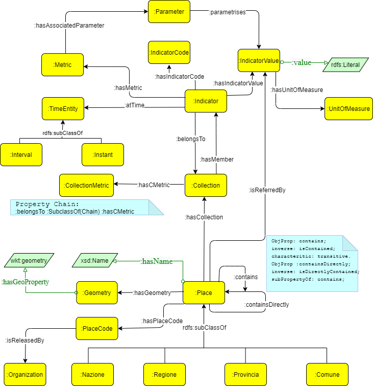

# Knowledge Engineering Report

You can use the [editor on GitHub](https://github.com/MScaramuzzi/test-KE/edit/gh-pages/index.md) to maintain and preview the content for your website in Markdown files.

## Abstract

Soil consumption is a phenomenon associated with the loss of fundamental environmental assets, due to the artificial occupation of originally natural soil. This issue is being monitored by SNPA (*Sistema Nazionale per la Protezione dell’Ambiente*), and in recent years an ontology was published by ISPRA (*Istituto Superiore per la Protezione e la Ricerca Ambientale*). This work aims to be a refactor of that ontology, although with a different approach to the matter.​

<!--ts-->


<!--te-->


## 1. Introduction

Soil consumption continues to transform the national territory at a high rate. In the last year, new artificial coverings have covered an additional  $57.5 \space km^2$  or, on average, about $16 \space hectares \space per \space day$. (an extension of about 21 soccer fields covered by artificial surfaces per day). 

The speed of land transformation recorded between 2017 and 2018 is maintained, i.e., 2 square meters of soil lost irreversibly every second. This is related to the construction and building of new infrastructures, the broadening of urban areas, but also to the expansion of agricultural areas. Indeed, the **most affected areas** are those with an **agricultural** vocation, where soil is consumption is about **three times more** than in urban areas. The phenomenon in the last year has been more intense in rural areas, where almost 2700 hectares have been cemented and less than half in medium-density urban areas.

In this work we aimed to create an ontology which is inspired by the one that was made by ISPRA. The said ontology makes massive use of many different vocabularies and external ontologies. This leads to the Knowledge Graph, and thus the ontology itself, to be very complex to understand and at times inefficient. Our work, instead, has been focused on achieving **efficiency** by adopting a design strategy that would lead to **simplicity** and conciseness of the ontology.

In this report paper we first briefly touch upon on related work that has been done in this field describing  how ISPRA-CORE is organized (***Section 2***). We then proceed to illustrate the ontology we designed by explaining the steps we have taken and also the issues that were encountered in order to formulate and formalize it. (***Section 3***).

After the description of the development of the ontology, we describe the process of **mapping** a Resource Description Framework (RDF) graph into triples through RDF Mapping Language (RML) (***Section 4***).

Subsequently we deal with the alignment of our ontology with general ontologies (DBpedia) and with sector specific vocabularies (World Meteorological Organization) (***Section 5***).

**6**

**7**


After that, we present a way to implement the ontology, providing some examples of SPARQL queries relative to the SPARQL endpoint we published. The last section in the report deals with the conclusions related to this work and to draw upon for future steps that could be taken to expand and improve our work (***Section 8***).

## 2. Related Work

Linked ISPRA is a pilot project for the development and use of methodologies aimed at the production and publication of Linked Open Data according to the standards set by the World Wide Web Consortium (W3C). The objective is to develop a process for the production of Linked Open Data (LOD) starting from a significant set of datasets, aimed at creating an internal expertise on the methodology of publication (RDF framework).

The datasets considered are related to the following matters:
* Wave network and associated meteorological data (real time)
* Tidal network and associated meteorological data (real time)
* Public interventions for hydrogeological instability
* **Soil consumption**

Clearly this kind of project has a broader grasp because it encompasses  different domains of interest, while our work is focused solely on soil consumption, allowing us to restrict the range of action and focusing on developing a **lighter** and simpler ontology which can function **autonomously**.

## 3. Ontology

In the following section we provide the necessary steps we took in order to formulate and formalize the Soil Consumption Ontology.

### 3.1 Design Methodology

*The main technique we used to develop the project was compliant with the norms and requirements of the eXtreme Design methodology.*

*After studying the specific domain of soil consumption, we formulated various Competency Questions (CQs) that helped shape the ontology, followed by the application and usage of Ontology Design Patterns (ODPs) in order to overcome expressivity issues.*

*After testing and adjusting various aspects of the ontology, we were finally able to complete it. Here are some examples of the CQs we used for modeling.*


| ID  | Competency Question                  |
|-----|--------------------------------------|
| CQ1 | What does an indicator describe?     |
| CQ2 | What are the coordinates of a place? |
| CQ3 | What metric describes the indicator? |
| CQ4 | What is the organization that provided the place's code  |
| CQ5 | What are  the indicators inside a collection? |

 **Table 1** - *Competency Questions used for modeling the ontology*

*By analyzing these CQs and many others like them, we were able to extrapolate a snapshot of the world that this domain was describing, and we used it to generate our classes in a way that matched to that precise pictures. We tried to represent the semantic connections between the various entities that populate this domain and give them their actual meaning as it was intended.*


### 3.2 Ontology Description

In the following figure we present the knowledge graph that represents classes and object properties that define our ontology:

​



The two main classes in this graph are **:Indicator** and **:Place**. These two classes subtend the components we want to focus on our domain: measurements and geographical coordinates.

Starting from the latter of the two, we can see that it was modeled by using the well-known Logical ODP N-Ary relation in order to distinguish the various types of locations. This instantiation of the pattern has four subclasses represented by **:Nazione**, **:Regione**, **:Provincia**, **:Comune**, which are characterized by a hierarchical feature, determined by the Logical ODP **Transitive Reduction**. In particular, it is defined with two properties **:contains** and **:containsDirectly**, the former being transitive.

*A **:PlaceCode** is associated to a **:Place**, and it can be released by any **:Organization** based on the country (ISTAT for Italy), this class was modeled in such a general way in order to make it independent of the country in which the ontology can be deployed on. An important feature of **:Place** is found in its **:Geometry**, which is a broader definition used to describe its geographical features which can vary from latitude and longitude to being a centroid, the specific implementation of this depends on how the **rdfs:Literal** is defined.*

To each **:Place** it is linked one or more :Collection of **:Indicator**. By using the Logical ODP **Property Chain**, if a **:Collection** is defined by a particular **:CollectionMetric**, the same metric is valid for the **:Indicator**, this feature is not meant to be used in our context, it is to generalize the ontology and facilitate its reuse in other domains of interest.(nei contesti di misurazioni???)

**:Indicator** itself is another application of the **N-Ary relation** pattern. The rationale behind this choice is that we needed to model a process that involved many classes at the same time. Any entity of **:Indicator** is provided with a **:atTime** relation, connected to a **:TimeEntity** that could be either an **:Instant** or a time **:Interval**. This design choice was made because we wanted to generalize the concept of time related to a particular indicator. As it was explained in the previous paragraph, an indicator is provided with a **:Metric** that represents the general type of measure an indicator is associated with (could be hectares, percentage, square meters etc.).

The **:hasParameter** relation is necessary to equip an indicator with the particular task it is used for (soil consumption, non-classified soil, inhabitants for hectare etc.), thus enabling to instantiate it to any application of the ontology by whomever aims to reuse it.

Lastly, an indicator has :IndicatorValue, which itself is connected with a **:UnitOfMeasure**. There is a distinction to be made between **:Metric** and **:UnitOfMeasure** the former represents the general metric associated with an indicator, while the latter represents the particular unit of measure of the value which may be  a multiple or a submultiple of the metric associated with the indicator (if **:Metric** is meters, **:UnitOfMeasure** can be centimeter, kilometers etc.). This again, was done in order to provide reusability to the ontology: some applications in very different domains may need different magnitude of a unit of measures.

## 4. Mapping rules and ontology publication(RML)

## 5. Deployement on Virtuoso - SPARQL Queries ??

## 6. Ontology alignment(LIMES) ??

## 7. How to deploy the system ??
 
## 8. Conclusion and future work

### Markdown

Markdown is a lightweight and easy-to-use syntax for styling your writing. It includes conventions for


```markdown

Syntax highlighted code block

# Header 1

## Header 2

### Header 3

- Bulleted

- List

​

1. Numbered

2. List

**Bold** and _Italic_ and `Code` text


[Link](url) and 

```

​
For more details see [GitHub Flavored Markdown](https://guides.github.com/features/mastering-markdown/).

