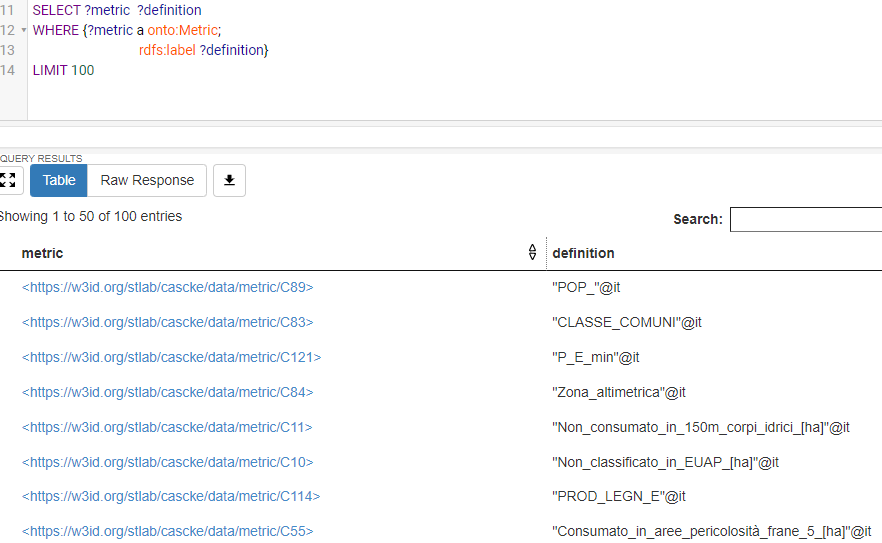

# Knowledge Engineering Report

## Abstract


Soil consumption is a phenomenon associated with the loss of fundamental environmental assets, due to the artificial occupation of originally natural soil. This issue is being monitored by SNPA (*Sistema Nazionale per la Protezione dell’Ambiente*), and in recent years an ontology was published by ISPRA (*Istituto Superiore per la Protezione e la Ricerca Ambientale*). This work aims to be a refactor of that ontology, although with a different approach to the matter.​

<!--ts-->

<!--te-->


## 1. Introduction

Soil consumption continues to transform the national territory at a high rate. In the last year, new artificial coverings have covered an additional 57.5  km^2 or, on average, about 16  hectares per day(an extension of about 21 soccer fields covered by artificial surfaces per day).

The speed of land transformation recorded between 2017 and 2018 is maintained, i.e., 2 square meters of soil lost irreversibly every second. This is related to the construction and building of new infrastructures, the broadening of urban areas, but also to the expansion of agricultural areas. Indeed, the **most affected areas** are those with an **agricultural** vocation, where soil is consumption is about **three times more** than in urban areas. The phenomenon in the last year has been more intense in rural areas, where almost 2700 hectares have been cemented and less than half in medium-density urban areas.

In this work we aimed to create an ontology which is inspired by the one that was made by ISPRA. The said ontology makes massive use of many different vocabularies and external ontologies. This leads to the Knowledge Graph, and thus the ontology itself, to be very complex to understand and at times inefficient. Our work, instead, has been focused on achieving **efficiency** by adopting a design strategy that would lead to **simplicity** and conciseness of the ontology.

In this report we first briefly touch upon on related work that has been done in this field describing  how ISPRA-CORE is organized (***Section 2***).

In ***Section 3*** we briefly analyze the characteristics and limitations of the available data and we illustrate how they were made available for the RML processing.

We then proceed to illustrate the ontology we designed by explaining the design metodology we have employed and the patterns that were used.(***Section 4***).

After the description of the development of the ontology, we describe the process of **mapping** a Resource Description Framework (RDF) graph into triples through RDF Mapping Language (RML) (***Section 5***).

Then in ***Section 6*** we explain how we have deployed the system on a SPARQL endpoint through Virtuoso.

Subsequently we deal with the alignment of our ontology with general ontologies (DBpedia) (***Section 7***).

After that, we present a way to test the ontology through the use of the SPARQL endpoint we have published and also by pursuing the testing endeavour inside the Protégé enviroment
(***Section 8***).

The last section in the report deals with the conclusions related to this work and to draw upon for future steps that could be taken to expand and improve our work (***Section 9***).


## 2. Related Work

Linked ISPRA is a pilot project for the development and use of methodologies aimed at the production and publication of Linked Open Data according to the standards set by the World Wide Web Consortium (W3C). The objective is to develop a process for the production of Linked Open Data (LOD) starting from a significant set of datasets, aimed at creating an internal expertise on the methodology of publication (RDF framework).

The datasets considered are related to the following matters:
* Wave network and associated meteorological data (real time)
* Tidal network and associated meteorological data (real time)
* Public interventions for hydrogeological instability
* **Soil consumption**

Clearly this kind of project has a broader grasp because it encompasses  different domains of interest, while our work is focused solely on soil consumption, allowing us to restrict the range of action and focusing on developing a **lighter** and simpler ontology which can function **autonomously**.

## 3. Analysis of the data

The initial form of the data was charactersized by four different *csv* tables, one for each administration unit (**Nazione**,**Regione**,**Comune**,**Provincia**), plus one additional csv table, that explained the meaning of the metrics and parameters regarding soil consumption.

The four tables referred to the administration units contained data about the names and associated codes of each unit, along with **125** different **indicators** and their values.

The other table contained information about the metrics and parameters referred to the indicators. It is important to underline the fact that there were two versions of the tables referred to the administration units, namely the version referred to the year 2012 and the one referred to the year 2015. Due to the lack of computational power, we preferred to utilize only the data referred to the year 2012, in order to keep our **dataset** much **lighter** and easy to work with. 

Another important note to take into account is the following: the design of the ontology started from this data, but we tried to generalize it, in order to make it as scalable as possible, so its use can be broader and directed also to other domains different from this one. An example of this methodology will be described in section 4.2. 

In order to make the process of RML mapping easier and faster, we merged the four tables into **one csv** file of considerable size, containing all informations about the different administration units.

## 4. Ontology

In the following section we provide the necessary steps we took in order to formulate and formalize the Soil Consumption Ontology.

### 4.1 Design Methodology

The main technique we used to develop the project was compliant with the norms and requirements of the **eXtreme Design methodology**. After analyzing the data that was provided to us we formulated various **Competency Questions** (CQs) that helped shape the ontology, followed by the application and usage of **Logical** and **Content** **Ontology Design Patterns** (ODPs) in order to overcome expressivity issues.

After testing and tuning various aspects of the ontology, we were finally able to complete it. The CQs we used for modelingin are represented in  *Table 1*.


| ID  | Competency Question                  |
|-----|--------------------------------------|
| CQ1 |    What does a metric X define?  |
| CQ2 | What is the name of the place with code X? |
| CQ3 | What are the collections associated to all the places? |
| CQ4 | What are the collections associated to a specific place named X ?  |
| CQ5 | What is the value of an indicatorValue X? |
| CQ6 | To which collection does an indicatorValue X belong? |
| CQ7 | What are the metrics for the indicators?  |
| CQ8 |Which Place is referred by a certain IndicatorValue?   |
| CQ9 | What parameter is the metric X associated to?  |
| CQ10 | What are the indicators?  |
| CQ11 | What metric does an indicator have? |
| CQ12 | What are the parameters? |
| CQ13 | What the  metrics and parameters associated to the indicator X? |
| CQ14 | What the  metrics and parameters associated to the indicator X? |

 **Table 1** - *Competency Questions used for modeling the ontology*

We were able to extrapolate a **snapshot** of the **domain** of **knowledge** described in our ontology by analyzing these CQs and we used it to generate our classes in a way that matched a precise description of the domain. We aimed to make explicit the semantic connections between the various entities that populate this domain and to represent the intrinsic meaning that these entities underlie.

### 4.2 Ontology Description

In the following figure we present the knowledge graph that represents classes and object properties that define our ontology:
​


*Figure 1* - **Graphical representation of our ontology**


The two main classes in this graph are **:Indicator** and **:Place**. These two classes subtend the components we want to focus on our domain: measurements and geographical coordinates.

Starting from the latter of the two, we have the **:Place** class, characterized by two main subclasses named  **:Geometry**, which is the first example of the generalization of the ontolgy (as this particular kind of data is not present) and **:AdministrationUnit**. The latter has four subclasses represented by **:Nazione**, **:Regione**, **:Provincia**, **:Comune** (characterized by a hierarchical feature, determined by the **Logical ODP Transitive Reduction**. In particular, it is defined with two properties **:contains** and **:containsDirectly**, the former being transitive).

A **:PlaceCode** is associated to a **:Place**, and it can be released by any **:Organization** based on the country (ISTAT for Italy), this class was modeled in such a general way in order to make it independent of the country in which the ontology can be deployed on. An important feature of **:Place** is found in its **:Geometry**, which is a broader definition used to describe its geographical features which can vary from latitude and longitude to being a centroid, the specific implementation of this depends on how the **wkt:geometry** is defined.

To each **:Place** are linked one or more  **:Collection** of **:Indicator**. Here it possible to witness the use of one **Content ODP**, used to link the two classes mentioned above, by the object properties **:hasMember** and **:isMemberOf** which are the **inverse** of one another.

**:Indicator** itself is an application of the **N-ary relation** pattern. The rationale behind this choice is that we needed to model a process that involved many classes at the same time. Any entity of **:Indicator** is provided with a **:atTime** relation, connected to a **:TimeEntity** that could be either an **:Instant** or a time **:Interval**, which is another instantiation of a **Content ODP**. This design choice was made because we wanted to generalize the concept of time related to a particular indicator, even if the available data did not include this feature.

An indicator is provided with a **:Metric** that represents the general type of measure an indicator is associated with, like soil consumption, non-classified soil, inhabitants for hectare and its relative unit of measure (could be hectares, percentage, square meters etc.). Something to be taken into account is that these relation are modelled after the **Observation Content Pattern**. 

The **:hasAssociatedParameter** relation is necessary to equip a **:Metric** with the particular task it is used for, providing further information on what it is describing (e.g. soil consumed at 150 meters from coastal borders) , thus enabling to instantiate it to any application of the ontology by whomever aims to reuse it.

Lastly, an indicator has **:IndicatorValue**, which itself is connected with a **:UnitOfMeasure**. There is a distinction to be made between **:Metric** and **:UnitOfMeasure** the former represents the general metric associated with an indicator, while the latter represents the particular unit of measure of the value which may be  a multiple or a submultiple of the metric associated with the indicator (e.g. if **:Metric** is meters, **:UnitOfMeasure** can be centimeter, kilometers etc.). This again, was done in order to provide reusability to the ontology: some applications in very different domains may need different magnitude of a unit of measures.

## 5. Mapping rules and ontology publication(RML)

In order to proceed for this step, the use of the pyRML python engine developed by Andrea Nuzzolese was necessary.

The process of knowledge extraction started from the study and comprehension of the data we wanted to map: the data itself was composed of various csv tables we got directly from the ISPRA soil consumption web page.

After understanding what kind of information these tables bore, the first step was to merge all the tables regarding the places (region, municipality, etc.) and the relative indicator values (from C1 to C125), resulting in a large **8177x127** csv file called **Places.csv**.

The other table we used for mapping the data was the one that contained information about the indicator metrics and parameters, called **Info.csv**. In the making of these resulting tables, processes of data cleaning were also utilized. The mapping itself consists in a RML file developed in Turtle syntax, which involves five subject maps (and other object maps), used to map Places, Metrics, Indicator Values, Indicators and Parameters.

While the triples maps for Metrics and Parameters were straightforward and relatively simple, for the other maps it was necessary to do a work of Python function injection.
In fact, it was necessary to modify the python code inside the converter.py file, adding the notion of “parameters”, making it possible to iterate inside the Turtle file, which proved to be very useful for the mapping endeavour.

The final code, relative in particular to the triples maps for the Places, Indicator-Values and Indicators, is characterized by the presence of for loops that are used to iterate trough the already cited variable called “**parameters**”. This kind of injection was crucial in order to correctly map the 125 indicator values associated to each place.

The following is an extract of the RML, specifically the part relative to the triples map defining the indicators and their associated metric:

 


Figure 2 - **Code for RML extraction of data**


In this figure, other than the already mentioned python function injection that opens at line 100 and closes at line 115 denoted by the curly brackets, it possible to notice how the class of the indicators was mapped.

At line 104, we defined the template in such way that it contained both the place code and the parameter relative to the single indicator. By committing to this design choice the result is that a single indicator is defined by the place it is associated to and its metric code.

An example of a triple for this kind of mapping could be the following:

<https://w3id.org/stlab/cascke/data/indicator/42017_C2>
<http://www.w3.org/1999/02/22-rdf-syntax-ns#type> <https://w3id.org/stlab/cascke/ontology/Indicator>.

<https://w3id.org/stlab/cascke/data/indicator/45010_C2> <https://w3id.org/stlab/cascke/ontology/hasMetric> 
<https://w3id.org/stlab/cascke/C2>.

This particular set of triples would be describing an indicator associated to the Municipality of Fabriano and its relative metric C2 that corresponds to non-consumed soil. 

In total, this mapping counts **5032797 triples** triples and it was uploaded on the IRI W3ID namespace provided by STlab.


## 6. Deployment on Virtuoso - SPARQL Queries

In this project we have employed Fuseki for publishing our data on a SPARQL endpoint. This choice was motivated by the ease of use of Fuseki.  We have loaded the data produced by the mapping (*caske.ttl*) by using the User Interface provided by Fuseki.

The high variety of types of indicators of soil consumption which are associated to each Place (C1,..,C125)  makes the output file of the size almost 1.4 GB because it stores 5032797 triples.


We have employed Fuseki in order to test queries on our local machine and subsequentially we have deployed it to a virtual machine on Virtuoso in order to make it available online.

## 7. Ontology alignment(LIMES)

Few of the classes in our ontology are actually present in the data produced by the mapping process, this is due the fact that classes encode very high level and general concepts our aim has been to achieve **high reusability**.

Given the fact that a lot of classes aren't actually represented in the mapping of the data, very few classes can be aligned with common use ontologies such as **DBpedia**.

Still, it has been possible to align the class **:Place** with the equivalent class in DBpedia.


We have actually opted to align the class **:PopulatedPlace** which reduces the number of instances to look for in DBpedia, this has been done in order to **reduce** the computation **time** of the alignment which would have been incredibly lengthy.

We have realized the alignment by exploiting **LIMES**, a command line tool that can be configured through an XML file. It is possible to insert the information needed for the alignment by tuning some of the tags in the configuration file of LIMES, which we called **file.xml**.

In this document we specify the endpoint SPARQL of the **SOURCE** (Soil Consumption Ontology) and the **TARGET** (DBpedia) ontology. In this case the two are:

* <http://localhost:3030/soil/sparql>
* <http://dbpedia.org/sparql>

### 7.1 Relevant tags for the alignment in the configuration file

We can now analyze some of the relevant tags for understanding the alignment process:

```XML
<PAGESIZE> 500000 </PAGESIZE> 
```  

* This tag represents maximal number of triples returned for each query by the SPARQL endpoint during the alignment process.


```XML 
<METRIC> jaccard(s.name,t.name) </METRIC>
```

* In this tag we specify the type of Link Specification to perform. In this case we have chosen the **Jaccard index** which is a statistic used for comparing the similarity and diversity of sample sets, is defined as the size of the intersection divided by the size of the union of the sample sets

```XML
<ACCEPTED_THRESHOLD> 0.9 </ACCEPTED_THRESHOLD> <!--default value is 0.98-->
```

* Here we are setting  minimum value that two instances must have in order to satisfy the relation specified in the RELATION tag, in our case **owl:sameAs**. We have chosen 0.9 for Accepted in order to not reject too many instances which are very close to satisfying the condition.

After invokating Limes through the command line, this is the result of the alignment process.


We can see that **1882** triples have been aligned.

### 7.2 Alignment testing - SPARQL Queries

After we the alignment process we procedeed to upload the *accepted.nt* to Fuseki as a named-graph in order to test if the alignment process was successful. We have made two queries to test this.

#### 7.2.1 Query 1

```SPARQL
SELECT *
WHERE {
    ?s ?p ?o
}

```

The first query is useful for getting a general look at the result set. There 1882 triples which are the contents of the accepted.nt file.

#### 7.2.2 Query 2

Now we want to display, for example, the number of unique Places both in the source and in target ontology. The only relation in this file is the owl:sameAs.


```SPARQL
SELECT (COUNT(*) as ?uniqueSourcePlaces){
	SELECT DISTINCT  ?s
  WHERE {
	?s ?p ?o
	}
}
```


We can see that there are 1646 **unique** places in our ontology.

```SPARQL
SELECT (COUNT(*) as ?uniqueTargetPlace){
	SELECT DISTINCT  ?o
  WHERE {
	?s ?p ?o
	}
}

```


We can see that there are 1806 **unique** places aligned in the target ontology.

From this we can infer that there are some redundancies in the ontologies aligned, especially in the source ontology where there 1646 unique Places but there 1882 triples.

## 8. Testing of the ontology

The testing part of this project was divided in three steps:
1.**CQs Verification**  
2. **Inference Verification**
3. **Error Provocation**


### 8.1 CQs through SPARQL queries

CQs verification consists in testing whether the ontology vocabulary allows to convert a CQs to a SPARQL query. Thanks to this kind of testing we denoted some flaws in our data and vocabulary, that were soon after corrected.


#### 8.1.1 CQ1: What are the collections associated to a specific place named X?

```SPARQL
SELECT ?metric  ?definition
WHERE {?metric a onto:Metric;
                               rdfs:label ?definition}                           
```





#### 8.1.2 CQ4: What are the collections associated to a specific place named X?

###### Query for a place that is provided with a code for the "Provincia"

By implementing CQ4 we want to test that there is a collection of associated to each place.

In the first query we test it on a place that is both a "Provincia" and a "Comune". We can see that the result sets is compliant with our expectations: there is a collection of Indicator Values that are associated to an unique place.

As we can see there is a different set of values because the collections of measurments pertain two different entities.

```SPARQL
PREFIX dbpo: <http://dbpedia.org/ontology/>
PREFIX owl: <http://www.w3.org/2002/07/owl#>
PREFIX rdf: <http://www.w3.org/1999/02/22-rdf-syntax-ns#>
PREFIX foaf: <http://xmlns.com/foaf/0.1/>
PREFIX my: <http://www.mobile.com/model/>
PREFIX rdfs: <http://www.w3.org/2000/01/rdf-schema#> 
PREFIX xsd: <http://www.w3.org/2001/XMLSchema#> 
PREFIX onto: <https://w3id.org/stlab/cascke/ontology/>

SELECT ?collection ?placeCode 
WHERE { ?placeCode a onto:Place;
                              onto:hasCollection ?collection;
                              onto:hasName ?placeName.
FILTER(?placeName = "Bari") }
```


###### Query for a place that is provided with only a code for the "Comune"

```SPARQL
SELECT ?collection ?placeCode
WHERE { ?placeCode a onto:Place;
                              onto:hasCollection ?collection;
                              onto:hasName ?placeName.
FILTER(?placeName = "Bari") }
```


#### 8.1.3 CQ8: Which Place is referred by a certain IndicatorValue??

By implementing CQ1 we want to test if each place has an associated value.

In the first query we have used keyword *SAMPLE* to show that every place has at least one IndicatorValue associated to it.

```SPARQL
PREFIX dbpo: <http://dbpedia.org/ontology/>
PREFIX owl: <http://www.w3.org/2002/07/owl#>
PREFIX rdf: <http://www.w3.org/1999/02/22-rdf-syntax-ns#>
PREFIX foaf: <http://xmlns.com/foaf/0.1/>
PREFIX my: <http://www.mobile.com/model/>
PREFIX rdfs: <http://www.w3.org/2000/01/rdf-schema#> 
PREFIX xsd: <http://www.w3.org/2001/XMLSchema#> 
PREFIX onto: <https://w3id.org/stlab/cascke/ontology/>


SELECT   ?place (SAMPLE(?indicatorValue) as ?value)

WHERE { ?placeCode  a onto:Place;
                                       onto:isReferredBy ?indicatorValue;
                                       onto:hasName ?place }    

GROUP BY ?place
ORDER BY ?place
LIMIT 1000  
```


In order to see every indicator value associated to every place the query would be the following. LIMIT keyward was needed due to the size of the output, which would take a lot of time to compute.

```SPARQL
PREFIX dbpo: <http://dbpedia.org/ontology/>
PREFIX owl: <http://www.w3.org/2002/07/owl#>
PREFIX rdf: <http://www.w3.org/1999/02/22-rdf-syntax-ns#>
PREFIX foaf: <http://xmlns.com/foaf/0.1/>
PREFIX my: <http://www.mobile.com/model/>
PREFIX rdfs: <http://www.w3.org/2000/01/rdf-schema#> 
PREFIX xsd: <http://www.w3.org/2001/XMLSchema#> 
PREFIX onto: <https://w3id.org/stlab/cascke/ontology/>

SELECT ?place ?indicatorValue
WHERE { ?placeCode  a onto:Place;
                                       onto:isReferredBy ?indicatorValue;
                                       onto:hasName ?place }

LIMIT 1000
```


#### 8.1.4 CQ9: What are the collections associated to a specific place named X?

```SPARQL
SELECT  ?metric ?parameter
WHERE {?metric a onto:Metric;
                               onto:hasAssociatedParameter ?parameter}
```


#### 8.1.5 CQ11: What metric does an indicator have?

```SPARQL
SELECT  ?indicator ?metric
WHERE {?indicator a onto:Indicator;
                                   onto:hasMetric ?metric}
```


#### 8.1.6 CQ12: What are the parameters?

```SPARQL
SELECT  ?parameter
WHERE {?parameter a onto:Parameter}
```


#### 8.2 Inference Verification

During the development of the ontology on Protégé we checked the consistency of our project by running on of the reasoners provided by the desktop app, in our case it was HermiT 1.4.3.


*Figure x* - **Output generated by executing of the reasoner**

 Whenever it revealed any inconsistency we corrected it, in order to make our ontology consistent.


### 8.3 Error Provocation

Another important part of the testing process is to verify that any purposely wrong input in the ontology is correctly discovered. This is done also in Protegè, by creating an individual that does not follow the rules or axioms of the ontology. As an example, we tried to give as an input an individual that had all the characteristics of an Indicator, but marked it as a Parameter. When running HermiT, the flaw was correctly spotted.


Figure x - **Error provocation test** 


As it ca be seen, the reasoner correctly spotted the error, meaning that the proper disjointess axiom was implemented.


## 9. Conclusions and future work

### 9.1 Conclusions

* The data present in the csv files is not really comprehensive, thus the data  mapped from our ontology is not able to capture many of the classes we designed.
  * In order to be able to extract more knowledge the project would need to start from a better source of data.

### 9.2 Future work

...
